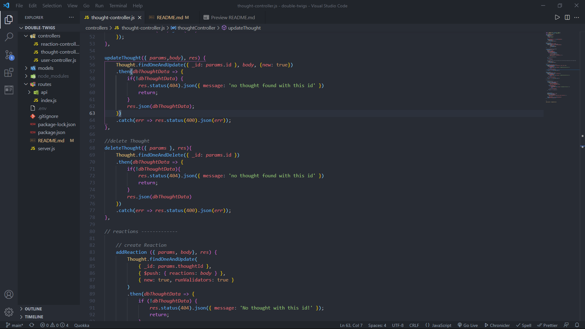

[![MIT License][license-shield]][license-url]


<br />
<p align="center">
  

  <h3 align="center">Social Network API</h3>

  <p align="center">
    An API focusing primarily data using MongoDb and Mongoose.
    <br />
    <a href="https://github.com/brandon-stewart-rgb/double-twigs"><strong>Explore the docs »</strong></a>
    <br />
    <br />
    <a href="https://watch.screencastify.com/v/wX1udNp9IjicnJr32BK6">VIEW DEMO HERE</a>
    ·
    <a href="https://github.com/brandon-stewart-rgb/double-twigs/issues">Report Bug</a>
    ·
    <a href="https://github.com/brandon-stewart-rgb/double-twigs/issues">Request Feature</a>
  </p>
</p>


<!-- TABLE OF CONTENTS -->
<details open="open">
  <summary>Table of Contents</summary>
  <ol>
    <li>
      <a href="#about-the-project">About The Project</a>
      <ul>
        <li><a href="#built-with">Built With</a></li>
      </ul>
    </li>
    <li>
      <a href="#getting-started">Getting Started</a>
      <ul>
        <li><a href="#prerequisites">Prerequisites</a></li>
        <li><a href="#installation">Installation</a></li>
      </ul>
    </li>
    <li><a href="#usage">Usage</a></li>
    <li><a href="#roadmap">Roadmap</a></li>
    <li><a href="#contributing">Contributing</a></li>
    <li><a href="#license">License</a></li>
    <li><a href="#contact">Contact</a></li>
    <li><a href="#acknowledgements">Acknowledgements</a></li>
  </ol>
</details>


<!-- ABOUT THE PROJECT -->
## About The Project (screenshot)




This is a social network API that uses Mongoose models that are synced with MongoDB. The routes were tested in Insomnia Core with properly formatted JSON using POST, GET, PUT and DELETE to successfully create, update, and delete users thoughts, reactions, friends, etc.

Social Network API Features:
* Uses a NoSQL database
* NoSQL database can handle large amounts of unstructured data.
* Uses both standalone schemas and nested schemas with a parent/child relationship.


### Built With

This section should list any major frameworks that you built your project using. Leave any add-ons/plugins for the acknowledgements section. Here are a few examples.
* [Node](https://nodejs.org/en/)
* [Mongoose](https://mongoosejs.com/)
* [MongoDb](https://www.mongodb.com/)
* [Moment](https://momentjs.com/)


<!-- GETTING STARTED -->
## Getting Started

To set up this project locally: 

### Prerequisites

Install NPM and Node
* npm
  ```sh
  npm install npm@latest -g
  ```
* Nodejs
 [https://nodejs.org/en/download/](https://nodejs.org/en/download/)
  

### Installation


1. Clone the repo
   ```sh
   git clone https://github.com/your_username_/double-twigs.git
   ```
2. Install NPM packages
   ```sh
   npm install
   
3. Test routes in Insomnia Core
   ```sh
   http://localhost:3001/api/thought/


<!-- USAGE EXAMPLES -->
## Usage

Use this software at your own risk


<!-- ROADMAP -->
## Roadmap

There are no open issues or a list of proposed future features.


<!-- CONTRIBUTING -->
## Contributing

Contributions are what make the open source community such an amazing place to learn, inspire, and create. Any contributions you make are **greatly appreciated**.

1. Fork the Project
2. Create your Feature Branch (`git checkout -b feature/AmazingFeature`)
3. Commit your Changes (`git commit -m 'Add some AmazingFeature'`)
4. Push to the Branch (`git push origin feature/AmazingFeature`)
5. Open a Pull Request


<!-- LICENSE -->
## License

Distributed under the MIT License. See `LICENSE` for more information.


<!-- CONTACT -->
## Contact

Brandon Stewart -  brandon@brandon.com

Project Link: [https://github.com/your_username/double-twigs](https://github.com/your_username/double-twigs)


<!-- ACKNOWLEDGEMENTS -->
## Acknowledgements
* [GitHub Emoji Cheat Sheet](https://www.webpagefx.com/tools/emoji-cheat-sheet)
* [Img Shields](https://shields.io)
* [Choose an Open Source License](https://choosealicense.com)
* [GitHub Pages](https://pages.github.com)


<!-- MARKDOWN LINKS & IMAGES -->
<!-- https://www.markdownguide.org/basic-syntax/#reference-style-links -->
[contributors-shield]: https://img.shields.io/github/contributors/othneildrew/Best-README-Template.svg?style=for-the-badge
[contributors-url]: https://github.com/othneildrew/Best-README-Template/graphs/contributors
[forks-shield]: https://img.shields.io/github/forks/othneildrew/Best-README-Template.svg?style=for-the-badge
[forks-url]: https://github.com/othneildrew/Best-README-Template/network/members
[stars-shield]: https://img.shields.io/github/stars/othneildrew/Best-README-Template.svg?style=for-the-badge
[stars-url]: https://github.com/othneildrew/Best-README-Template/stargazers
[issues-shield]: https://img.shields.io/github/issues/othneildrew/Best-README-Template.svg?style=for-the-badge
[issues-url]: https://github.com/othneildrew/Best-README-Template/issues
[license-shield]: https://img.shields.io/github/license/othneildrew/Best-README-Template.svg?style=for-the-badge
[license-url]: https://github.com/othneildrew/Best-README-Template/blob/master/LICENSE.txt
[linkedin-shield]: https://img.shields.io/badge/-LinkedIn-black.svg?style=for-the-badge&logo=linkedin&colorB=555
[linkedin-url]: https://linkedin.com/in/othneildrew
[product-screenshot]: images/screenshot.png
